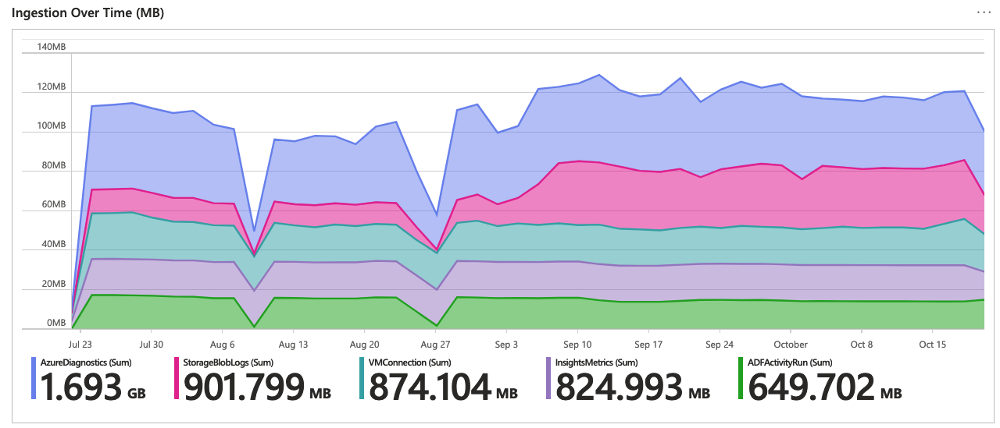
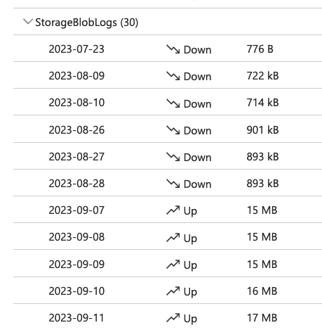
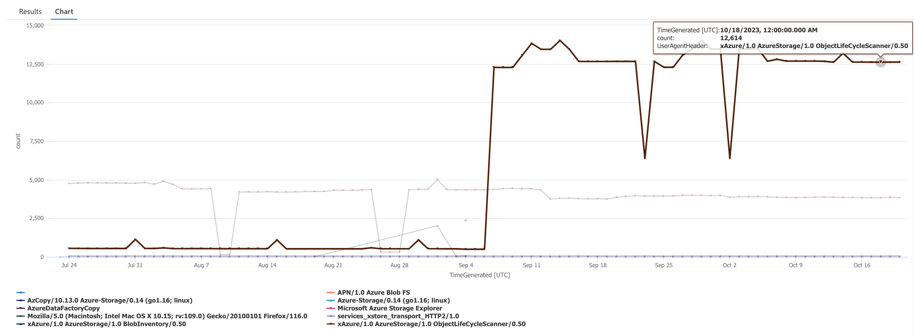
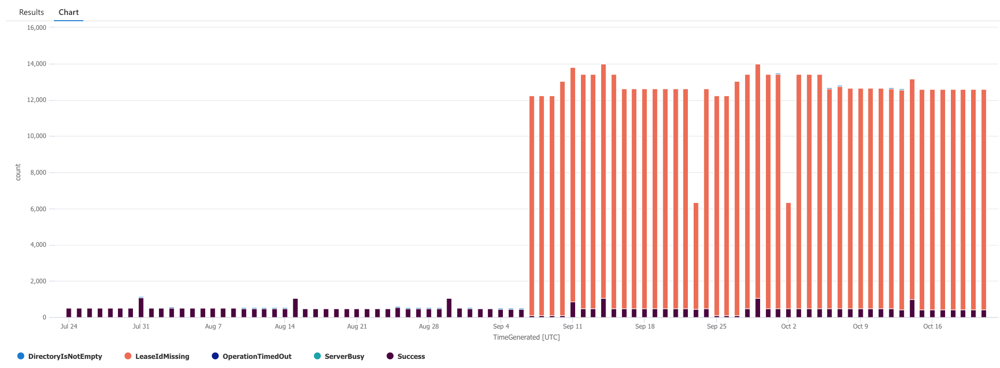
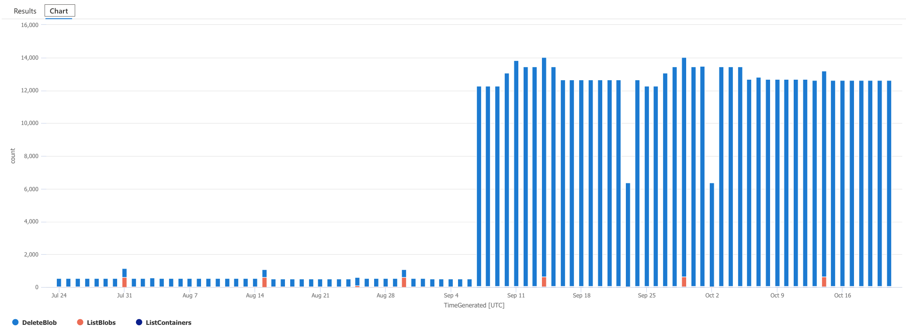

Recently I added [blob lease](https://learn.microsoft.com/en-us/azure/storage/blobs/storage-blob-lease#about-blob-leases) to some files that were in the container having lifecycle management policy to delete files that are 30 days old.

The documentation using both simultaneusly is really vague:

* TBD: Could not find my sources afterwards anymore.

## The failure

I had to mark some files not to be deleted by lifecycle management policy. I did both:

* added ininite lease to blobs
* copied blobs to other storage account

## The first symptom

I noticed a huge increase on **StorageBlobLogs** table ingression rate on **Log Analytics Insights** workbook:

**Log Analytics insights** / **Ingestion Over Time (MB)**



**Log Analytics insights** / **Ingestion Anomalies**



## Next steps

I did not remember turning on lease for blobs and therefore I had to investigate **StorageBlobLogs** table to find the root cause for ingestion changes.

### The first query: Who is making request?

Query:

```kql
let ll = (s:string) {
  iff(s contains "AzureDataFactoryCopy", "AzureDataFactoryCopy", 
    iff(s contains "APN/1.0 Azure Blob FS", "APN/1.0 Azure Blob FS", 
      iff(s contains "Microsoft Azure Storage Explorer", "Microsoft Azure Storage Explorer", s)
    )
  )
};
StorageBlobLogs
| where TimeGenerated > ago(90d)
| summarize count=count() by UserAgentHeader=ll(UserAgentHeader), bin(TimeGenerated, 1d)
```

Result:



It is fairly easy to blame `ObjectLifeCycleScanner` with that kind of results but why is it misbehaving?

### The second query: What are the results of the queries?

Query:

```kql
StorageBlobLogs
| where TimeGenerated > ago(90d)
| where UserAgentHeader == "xAzure/1.0 AzureStorage/1.0 ObjectLifeCycleScanner/0.50"
| summarize count=count() by StatusText, bin(TimeGenerated, 1d)
```

Result:



Now it is fairly easy to notice that requests are failing because `ObjectLifeCycleScanner` does not include lease id with the requests.

To delete leased file request must [include lease id](https://learn.microsoft.com/en-us/rest/api/storageservices/delete-blob?tabs=azure-ad#request-headers) in the request headers. `ObjectLifeCycleScanner` does not do that and the requests will fail.

### Bonus query: What of lifecycle process trying to do?

Query:

```kql
StorageBlobLogs
| where TimeGenerated > ago(90d) and UserAgentHeader == "xAzure/1.0 AzureStorage/1.0 ObjectLifeCycleScanner/0.50"
| summarize count=count() by OperationName, bin(TimeGenerated, 1d)
```

Result:



The result displays that failed action are DeleteBlob actions.

## Summary

Using leases with Storage Account that has deletion lifecycle management policy enabled will cause issues:

* `ObjectLifeCycleScanner` will try to delete blobs and fail
* `ObjectLifeCycleScanner` will try to delete blog 15 or 30 times per day
  * All failed deletions will create a entry in the `StorageBlobLogs`table

I did not test what happens if lifecycle management policy action is to change accesss tier instead of deletion. [Set Blob Tier](https://learn.microsoft.com/en-us/rest/api/storageservices/set-blob-tier?tabs=azure-ad) documentation does not mention lease id. If anyone tests this, please let me know if `ObjectLifeCycleScanner` can change tier of leased blobs.
